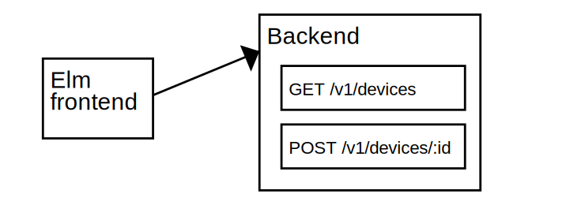

# Testing programs with Cmds

`elm-program-test` allows you to test and simulate responses to
`Cmd`s produced by your Elm program.
(The rest of this page walks through an example of how to do that.)
Testing your program in this way gives a few notable benefits:

Your tests will
**more clearly describe how your app interacts with other systems**.
Steps in your test will read like
"then the pending HTTP request to `example.com` fails with a network error"
instead of
"then the update function gets called with the `FetchResponse (Err NetworkError)` message".

Your tests will be **more robust to refactoring of your implementation code**.
Because your tests don't need to directly refer to the internals of your program,
your tests will still be valid even if you make drastic changes to the architecture of your code
(like extracting new modules, renaming types or variants,
or entirely reworking the flow of messages within your program). 

::: warning NOTE

`elm-program-test`'s features for testing effects depend on
being able to know what a given effect value represents.
In the [Elm architecture](https://guide.elm-lang.org/effects/),
effects are normally represented by the `Cmd msg` type.
Unfortunately, Elm does not currently provide a way to 
inspect `Cmd` values to see which commands they represent.
There's some extra work required to get around this current limitation,
which the rest of this page will walk you through.

Hopefully you'll agree that the benefits (listed above) of testing your program in this way
will be worth the extra effort!
But be aware of this trade-off when considering whether this type of testing is right for your program.
 
:::


## Introducing the example program

The rest of this page will be working with an example program
that interacts with a fictional API for controlling the lights in your house.

This diagram shows the architecture of the example application.
The Elm code makes HTTP requests to two different endpoints:
`/v1/devices` to get a list of all the lights that can be controlled,
and `/v1/devices/:id` to change the setting of a specific light.




## Goal: the ideal test

The test we want to write represents the following scenario:

1. The user loads the main page
1. The page requests the list of lights
1. The server responds with the list of lights and their current states
1. The user clicks "Turn on" for the kitchen lights
1. We expect the page to send a request to the server with the correct values

Here's what that test will look like in code:

```elm
import Expect
import ProgramTest
import Test exposing (test)

test "controlling a light" <|
    \() ->
        start
            |> ProgramTest.simulateHttpOk
                "GET"
                "http://localhost:8003/lighting_service/v1/devices"
                """[{"id":"K001", "name":"Kitchen", "dimmable":false, "value":0}]"""
            |> ProgramTest.clickButton "Turn on"
            |> ProgramTest.expectHttpRequest
                "POST"
                "http://localhost:8003/lighting_service/v1/devices/K001"
                (.body >> Expect.equal """{"value":1}""")
```

However, running this test produces the following failure:

```
↓ HomeAutomationExampleTest
✗ controlling a light

    TEST SETUP ERROR: In order to use simulateHttpResponse,
    you MUST use ProgramTest.withSimulatedEffects before calling ProgramTest.start


TEST RUN FAILED
```

As the error explains, we must use `ProgramTest.withSimulatedEffects`
before the test will work.
But using it requires us to provide a function of type `effect -> ProgramTest.SimulatedEffect`.
Because the effect type of our program
(the type that `init` and `update` return as the second item in the tuple)
is currently `Cmd Msg` (which Elm does not currently allow us to inspect the values of),
we'll need to do the following before the test will work:

1. Make a new type which can represent all the effects our program can produce.
1. Implement the required `effect -> ProgramTest.SimulatedEffect` function.
1. Use `withSimulatedEffects` to set up the test.
1. ✅ Watch the test pass! 


## Making it work


### Planning the change

Since Elm does not currently allow us to inspect `Cmd` values,
the first thing we need to do is define a new type that we *can* inspect
that can represent all the effects that our `update` and `init` functions
want to produce.
Our `init` and `update` functions will change to use this new type,
and we'll also need to define a function that can turn this new type
into `Cmd`s for when our program is compiled for production.

So in our existing main module:

```elm
init : Flags -> ( Model, Cmd Msg )
update : Msg -> Model -> ( Model, Cmd Msg )
```

will change to:

```elm
type Effect

init : Flags -> ( Model, Effect )
update : Msg -> Model -> ( Model, Effect )

perform : Effect -> Cmd Msg
```


### Defining an "Effect" type

Taking a look through the `init` and `update` functions,
<!-- TODO: link to original code -->
the following `Cmd`s are being produced &mdash;
the new type we make will need to have a variant for each one:

- `Cmd.none`
- `loadDeviceList`, which itself uses `Http.get`
- `changeLight`, which itself uses `Http.post`

Each variant we create should contain just enough information to
call the functions necessary to create the corresponding `Cmd`.
Following that guideline, we'll end up with an `Effect` type like this
and a corresponding `perform` function:

```elm
type Effect
    = NoEffect
    | GetDeviceList
        { url : String
        , decoder : Json.Decode.Decoder (List Light)
        , onResult : Result Http.Error (List Light) -> Msg
        }
    | ChangeLight
        { url : String
        , body : Json.Encode.Value
        , decoder : Json.Decode.Decoder Light
        , onResult : Result Http.Error Light -> Msg
        }

perform : Effect -> Cmd Msg
perform effect =
    case effect of
        NoEffect ->
            Cmd.none

        GetDeviceList { url, onResult, decoder } ->
            Http.get
                { url = url
                , expect = Http.expectJson onResult decoder
                }

        ChangeLight { url, onResult, decoder, body } ->
            Http.post
                { url = url
                , body = Http.jsonBody body
                , expect = Http.expectJson onResult decoder
                }
```

After changing `update` and `init` to return the corresponding `Effect` instead of a `Cmd`,
the final change to make the program compile again is to update our `main`
to make use of the `perform` function:

```elm{4-11}
main : Program Flags Model Msg
main =
    Browser.document
        { init =
            \flags ->
                init flags
                    |> Tuple.mapSecond perform
        , update =
            \msg model ->
                update msg model
                    |> Tuple.mapSecond perform
        , subscriptions = subscriptions
        , view = view
        }
```


### Simulating effects

Now that our `update` and `init` functions use an effect type that
we can inspect the values of, we can write a function for our test suite
that can convert our new `Effect` type into simulated effects that
`elm-program-test` can understand:

```elm
import SimulatedEffect.Cmd
import SimulatedEffect.Http

simulateEffects : Main.Effect -> ProgramTest.SimulatedEffect Main.Msg
simulateEffects effect =
    case effect of
        Main.NoEffect ->
            SimulatedEffect.Cmd.none

        Main.GetDeviceList { url, onResult, decoder } ->
            SimulatedEffect.Http.get
                { url = url
                , expect = SimulatedEffect.Http.expectJson onResult decoder
                }

        Main.ChangeLight { url, onResult, decoder, body } ->
            SimulatedEffect.Http.post
                { url = url
                , body = SimulatedEffect.Http.jsonBody body
                , expect = SimulatedEffect.Http.expectJson onResult decoder
                }
```

You may notice that this looks *extremely* similar to the `perform` function we wrote earlier.
The `SimulatedEffect.*` modules are designed to parallel the core Elm modules that produce `Cmd`s
so that writing your `simulateEffects` function is as straightforward as possible.

One last step!  Now that we have a function of the required type,
we can use it to enable effect simulation in our tests:

```elm{8}
start : ProgramTest Main.Model Main.Msg Main.Effect
start =
    ProgramTest.createDocument
        { init = Main.init
        , update = Main.update
        , view = Main.view
        }
        |> ProgramTest.withSimulatedEffects simulateEffects
        |> ProgramTest.start ()
```

Now that we've enabled effects simulation, [our original test](#goal-the-ideal-test)
will successfully run!

You may have noticed that the test itself never directly refers
to the effect values (`GetDeviceList` and `ChangeLight`) that we defined.
`elm-program-test` handles that for you &mdash;
when a `ProgramTest` receives an effect from your `init` or `update` functions,
it will use the `simulateEffects` function we provided to understand what the effect means
and update the state of the test accordingly.
You don't need to worry about the details of how this works &mdash;
just know that as long as you provide a `simulateEffects` function
you'll be able to use the full API provided by `ProgramTest` for testing HTTP requests.


## Try it out

You can play around with the example here:
<https://ellie-app.com/6wsbBjZ9z2Ma1>
Try editing the tests or the implementation to make the tests fail
and see what kind of failure messages you get.
