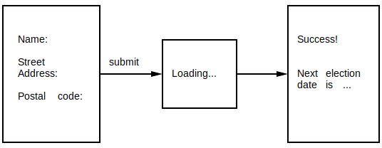

# Testing programs with interactive HTML

[`Test.Html` from the `elm-explorations/test` package](https://package.elm-lang.org/packages/elm-explorations/test/latest/Test-Html-Query)
make it possible to write unit tests for functions that return `Html msg`,
but often
(especially when your view is complicated enough to need to be tested)
good test coverage requires testing the interactions between your `view` and your `update` functions
(which communicate via the `Model` and `Msg`s).

`elm-program-test` lets you write "high-level" tests for your program %%%

%%% TODO: diagram of testing boundaries 


## Introducing the example program

In this example, we'll be writing a new program from scratch,
driving the development with tests,
and using the preferred features of `elm-program-test` to
encourage writing our UI in a way that makes it follow
some accessibility best practices.  

The program we'll be building is a simple voter registration form.
Here's the page flow a user will experience:

<!-- TODO: turn into SVG -->

```
+----------------+                                +---------------+
|                |                                |               |
|                |                                |               |
|  Name:         |          +------------+        | Success!      |
|                |          |            |        |               |
|  Street        | submit   |            |        |               |
|  Address:      |--------->| Loading... |------->| Next election |
|                |          |            |        | date is ...   |
|  Postal code:  |          |            |        |               |
|                |          +------------+        |               |
|                |                                |               |
|                |                                |               |
+----------------+                                +---------------+
```


Start with happy path program already implemented,  
and this guide will add a test for a form validation


## Setup

<!-- TODO: fill in link -->
(You can skip to the [next section]() if you are already familiar with
setting up Elm and `elm-test` for a new project.
All you need to know is that you'll need to install `avh4/elm-program-test`
as a test dependency.)


### Installing Elm and `elm-test`

You may prefer to follow the official installation instructions
[for Elm](https://guide.elm-lang.org/install.html)
and [for `elm-test`](https://github.com/rtfeldman/node-test-runner#readme),
but the quickest way to get started is:

```sh
npm install -g elm@elm0.19.0
npm install -g elm-test@elm0.19.0
mkdir example-app && cd example-app
```

### Initializing the project

Elm and `elm-test` both include command line tools that are able to help set up your project.
We'll use them both here:

```sh
elm init
elm-test init
elm-test install avh4/elm-program-test
```

The above commands will have created an appropriate `elm.json` and an example test file:

```
.
├── elm.json
├── src
└── tests
    └── Example.elm

2 directories, 2 files
```

and we can now run the example test with `elm-test`:

```sh
$ elm-test

elm-test 0.19.0-rev6
--------------------

Running 1 test. To reproduce these results, run: elm-test --fuzz 100 --seed 261089602546669 /Users/avh4/workspace/elm-program-test/example-app/tests/Example.elm


TEST RUN INCOMPLETE because there is 1 TODO remaining

Duration: 162 ms
Passed:   0
Failed:   0
Todo:     1
↓ Example
◦ TODO: Implement our first test. See https://package.elm-lang.org/packages/elm-explorations/test/latest for how to do this!

```


## Writing a program test

Our goal will be to write a test for the following happy-path scenario:

- The user fills in the form:
    - their name
    - their street address
    - their postal code
- The user submits the form.
- The server responds successfully.
- The app should now show the "Success!" screen

## Our first program test


```elm{22-33}
module VoterRegistrationExampleTest exposing (all)

import ProgramTest exposing (ProgramTest, clickButton, expectViewHas, fillIn, update)
import Test exposing (..)
import Test.Html.Selector exposing (text)
import VoterRegistrationExample as Main


start : ProgramTest Main.Model Main.Msg (Cmd Main.Msg)
start =
    ProgramTest.createDocument
        { init = Main.init
        , update = Main.update
        , view = Main.view
        }
        |> ProgramTest.start ()


all : Test
all =
    describe "voter registration frontend"
        [ test "happy path: successful registration" <|
            \() ->
                start
                    |> fillIn "name" "Name" "Bailey Sheppard"
                    |> fillIn "street-address" "Street Address" "14 North Moore Street"
                    |> fillIn "postcode" "Postal Code" "60606"
                    |> clickButton "Register"
                    |> update (Main.RegistrationResponse (Ok "Aug 12"))
                    |> expectViewHas
                        [ text "Success!"
                        , text "Next election date is: Aug 12"
                        ]
        ]
```

- `start`: ...
- `fillIn`: ...
- `clickButton`: ...


### (minimal Main module)

### test failure, and fix it...
